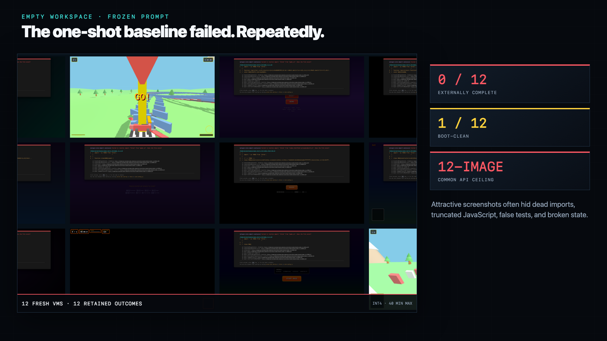

# Local Qwen 27B Gauntlet — 2026-07-30

This is the complete working bundle for a time-boxed experiment asking:

> Can Pi plus a local Qwen3.6-27B materially improve a real interactive
> Three.js game through Gauntlet-style test-time compute, and does official
> BF16 change the result relative to the production INT4 model?

Hard cutoff: **2026-07-31 06:00 America/New_York**.

## Honest result

- Empty-workspace INT4 baseline: **0/12 externally complete**.
- Replicated text-first repair condition: **5/10 complete**.
- Text-first empty-workspace tail replication: **0/8 corrected complete**,
  despite 6/8 boot-clean.
- Official BF16: **0/2 baseline and 0/2 matched repair**.
- Grounded Qwen critic→builder handoffs: **2 passes, 1 partial, 1 fail**.
- Peak serving load: **22/24 active cards**, with no persistent queue or
  admission rejection.
- Visual verdict: programmer/hobby prototypes, **not AAA-like**.
- Multiplayer gate: **not reached**.

The most useful finding was not “loop longer.” Ordered temporal evidence,
multiple independent Qwen critics, and cheap executable checks exposed a real
wheel-axis defect—and one blind Qwen critic caught a false positive in the
controller-authored evaluator. See [RESULTS.md](RESULTS.md).

## Watch the result

[Watch or download the final 91-second 1080p60 video](content/video/out/qwen-gauntlet-1080p60.mp4).
It combines real Pi-in-progress capture, fixed-step gameplay, matched
comparisons, infrastructure telemetry, and the final verdict. The automated
video QA and review contact sheet are retained in
[`content/video/out/qa/`](content/video/out/qa/).

The first game is **Apex Karts 64**: an original, code-generated low-poly kart
microgame with late-1990s console-kart energy. A hierarchical transfer suite
then uses the same agent stack and prompt skeleton to generate a kart racer,
arena game, and platformer from empty workspaces. None may copy Mario Kart,
Unreal Tournament, Quake, or any other protected characters, tracks, names,
audio, or assets.

The experiment starts with one kart and one lap. AI racers, escalating original
announcer calls, and a Quake-like multiplayer lobby are earned expansions, not
baseline requirements.

## What belongs here

- `brief/` — frozen protocol, deadline gates, sanitized technical details
- `prompts/` — exact prompts shown to the model
- `artifacts/` — extracted source, evidence, manifests, failures, and summaries
- `public/trajectories/` — every extracted Pi JSONL trajectory, byte-for-byte
- `metrics/` — objective results and blinded rubric scores
- `capture/` — deterministic browser, frame-step, and video harnesses
- `methodology/` — preregistration notes and evaluator changes
- `research/` — public source index and our observations
- `content/` — screenshots, clips, Remotion source, final video, and social copy
- `infra/` — sanitized disposable-VM and precision-swap tooling
- `skills/` — hashes/manifests for pinned public-skill treatments

Raw credentials, tokens, private endpoints, and private network topology never
belong in this repository.

Large raw VM tarballs, browser dependencies, uncompressed frame sequences, and
private aggregate logs remain local. Their checksums and the exact public
trajectories are retained; the omission is operational redaction, not outcome
selection.

## Honesty rules

1. “AAA-like” describes the trend's aspiration, not this output.
2. A fresh context using the same weights is not an independent judge.
3. Screenshots cannot prove handling, networking, or game correctness.
4. Broken gates, regressions, judge disagreement, and failed runs stay in the
   record.
5. Fable and frontier-model demos are context, not controlled baselines.
6. We report quality per wall-clock hour and GPU-hour, not just total tokens.
7. The Codex operator does not author or repair primary-arm game source.
8. Every primary source change must trace to a raw Pi+Qwen trajectory.
9. Each concurrent Pi/Qwen arm executes inside its own disposable KVM/QEMU
   server VM. This laptop is orchestration, evidence, and editing only.
10. Functional completion, visual quality, motion coherence, and real-time
    cadence are scored separately.
11. Deterministic fixed-step 60 fps footage is labeled as offline capture and
    never presented as evidence of real-time 60 fps performance.
